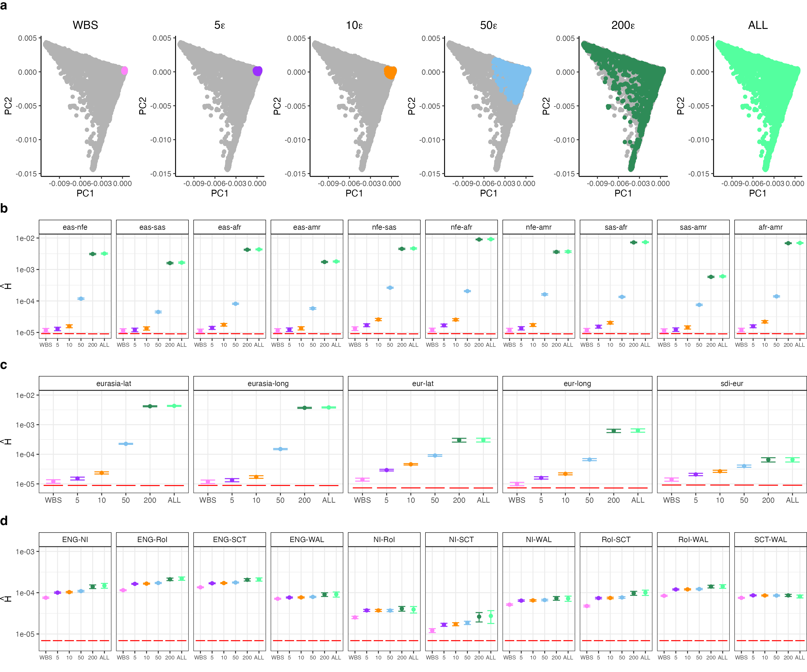
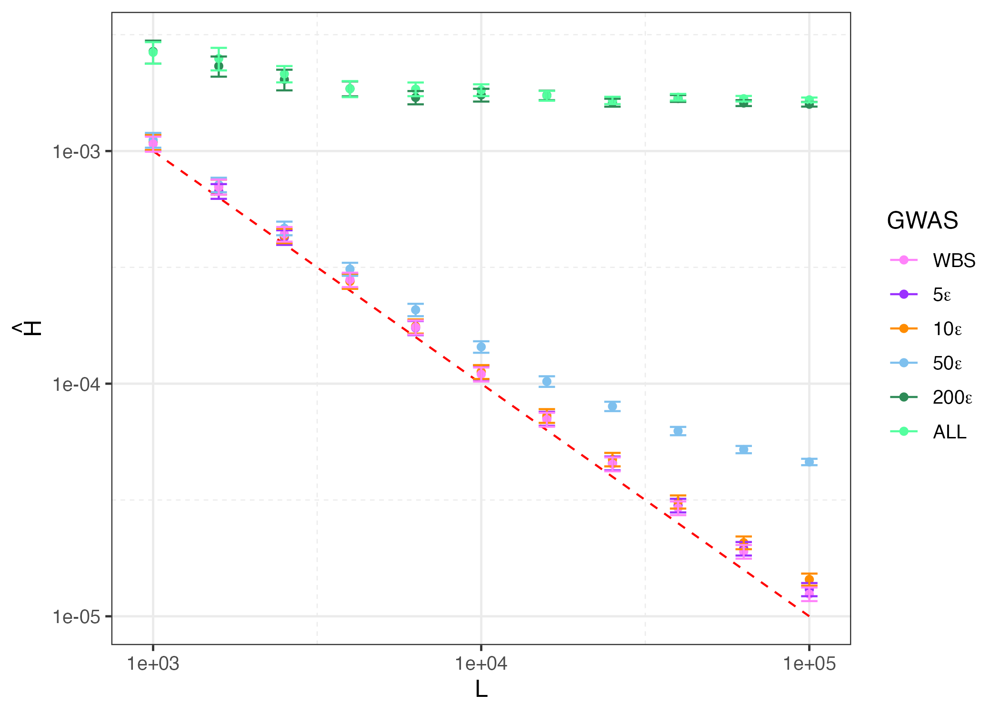

[← Back to Home]({{ '/' | relative_url }})

# Uncorrected Susceptibility

Once we have the allele frequency contrast $\hat{r}$ for a given prediction-panel axis (see [Genotype Contrasts](01-genotype-contrasts)), we can ask how much of the genetic variation in the GWAS panel is aligned with that axis. This is the **uncorrected susceptibility**, $H$ — our baseline measure of how exposed a polygenic score is to stratification along the target gradient, before any correction for population structure.

Formally, $H$ is the squared correlation between the GWAS panel genotypes and the observed contrast:

$$H = \text{Cor}^2(G, r) = \sigma_f^2 \, \sigma_{r}^2$$

where $\sigma_{r}^2$ is the variance of the allele frequency contrast across SNPs, and $\sigma_f^2$ is the variance of the GWAS individuals' positions along the **target axis** $f$ — the projection of the GWAS panel onto the ancestry gradient defined by $\hat{r}$. This page documents how we estimate both quantities, combine them into $\hat{H}$, and test whether $\hat{H}$ exceeds the noise floor expected under no structure.

---

## Overview of the estimator

We estimate $H$ in three pieces:

1. **Variance of the contrast, $\hat{\sigma}_{r}^2$.** The dispersion of $\hat{r}$ across the LD-pruned SNPs.
2. **The target axis, $\hat{f}$, and its variance $\hat{\sigma}_f^2$.** We project each GWAS individual's genotypes onto $\hat{r}$, computed block-by-block so that the same per-block scores can be reused for the block jackknife.
3. **$\hat{H}$ and its sampling distribution.** We form $\hat{H} = \hat{\sigma}_f^2 \hat{\sigma}_r^2$ and use a weighted block jackknife over approximately independent LD blocks to obtain a standard error and a $p$-value against the null $H \approx 1/L$.

All estimation is restricted to the set of LD-pruned, high-quality SNPs used to compute the UK Biobank principal components (pruned to pairwise $r^2 < 0.1$), intersected with the SNPs for which we have contrast values. This minimizes inflation of $\hat{H}$ due to linkage disequilibrium between nearby sites.

---

## Setup: Assigning SNPs to LD blocks

All standard errors on this page come from a block jackknife over approximately independent regions of the genome. We use the LD block definitions in `data/LD_blocks/big_blocks.bed` and assign every PC SNP to a block using [`add_block_info.R`](https://github.com/jgblanc/quantifying-susceptibility-PGS.github.io/blob/master/scripts/blocks/add_block_info.R):

```
rule block_snps:
    input:
        snps="data/ukbb/ukbb_pc_snps.txt",
        blocks="data/LD_blocks/big_blocks.bed"
    output:
        "data/ukbb/ukbb_pc_snps_block.txt"
    shell:
        """
        Rscript code/blocks/add_block_info.R {input} {output}
        """
```

Internally, each SNP is matched to the block whose start/stop coordinates contain its position:

```r
assign_SNP_to_block <- function(CHR, BP, block = ld) {
  block_chr <- block %>% filter(chr == CHR)
  first_start <- as.numeric(block_chr[1, "start"])
  block_bp <- block_chr %>% filter((start < BP & stop >= BP) | BP == first_start)
  block_num <- as.numeric(block_bp[, "block_number"])
  return(block_num)
}
```

The resulting file, `ukbb_pc_snps_block.txt`, carries a `block` label for each SNP and is used by every downstream rule on this page. In our analyses this yields $B = 581$ approximately independent blocks.

We also concatenate the per-chromosome genotypes down to the PC SNP set once, so that scoring can read from a single file:

```
rule concat_chr:
    input:
        pgen=expand(".../ukb_imp_chr{chr}_v3.pgen", chr=CHR),
        snps="data/ukbb/ukbb_pc_snps.txt"
    output:
        ".../ukb_pcSNPs_ALL_v3.pgen"
    shell:
        """
        plink2 --pmerge-list tmp_chr_list.txt \
        --extract {input.snps} \
        --make-pgen \
        --freq \
        --out {params.prefix_out}
        """
```

---

## Step 1: Variance of the contrast ($\hat{\sigma}_{r}^2$)

The variance of the allele frequency contrast is estimated directly across all $L$ overlapping, LD-pruned SNPs:

$$\hat{\sigma}_{r}^2 = \frac{1}{L-1} \sum_{\ell=1}^{L} \left( \hat{r}_\ell - \bar{\hat{r}} \right)^2$$

Because the observed contrast $\hat{r}$ contains both the component shared with the GWAS panel ($r^\ast$) and a prediction-panel-specific component ($r^\dagger$), this estimates the total variance $\sigma_{r}^2 = \sigma_{r^\ast}^2 + \sigma_{r^\dagger}^2$. The computation is handled by [`calc_rVar.R`](https://github.com/jgblanc/quantifying-susceptibility-PGS.github.io/blob/master/scripts/calculate_H/calc_rVar.R), which reads the per-chromosome `.rvec` files, restricts to the block-assigned PC SNPs, and writes out the variance and standard deviation of $\hat{r}$:

```r
# Combine per-chromosome r files with the pruned PC SNPs
dfALL <- inner_join(df, dfSNP) %>% drop_na()
L <- nrow(dfALL)

# Variance of the contrast
varR <- var(dfALL$r)
sdR  <- sd(dfALL$r)
```

---

## Step 2: Estimate $\hat{H}$ and test significance

The susceptibility estimate combines the variance of the target axis and the variance of the contrast:

$$\hat{\sigma}_{r}^2 = \frac{1}{L-1} \sum_{\ell=1}^{L} \left( \hat{r}_\ell - \bar{\hat{r}} \right)^2, \qquad
\hat{\sigma}_f^2 = \frac{1}{M-1} \sum_{m=1}^{M} \left( \hat{f}_m - \bar{\hat{f}} \right)^2, \qquad
\hat{H} = \hat{\sigma}_f^2 \cdot \hat{\sigma}_{r}^2.$$

Both variances and the jackknife are computed in a single pass by [`calc_H.R`](https://github.com/jgblanc/quantifying-susceptibility-PGS.github.io/blob/master/scripts/calculate_H/calc_H.R), which reads the contrast values, the per-block score matrix, and the block assignments:

```
rule calc_H:
    input:
        r=expand("data/{dataset}/r/{gwas}/{contrasts}_chr{chr}.rvec", chr=CHR),
        FGr = "output/calculate_FGr/{dataset}/{gwas}/FGrMat_{contrasts}.txt",
        snp_num = "output/calculate_FGr/{dataset}/{gwas}/SNPNum_{contrasts}.txt",
        Tvec = "data/{dataset}/TestVecs/{contrasts}.txt",
        pc_snps = "data/ukbb/ukbb_pc_snps_block.txt"
    output:
        H = "output/calculate_H/{dataset}/{gwas}/H_{contrasts}.txt"
    shell:
        """
        Rscript code/calculate_H/calc_H.R {params.r_prefix} {input.FGr} {input.snp_num} \
        {input.Tvec} {output.H} {input.pc_snps}
        """
```

The three quantities above correspond to three helper functions in the script — note that $\hat{\sigma}_{r}^2$ is computed here, directly from the contrast values, rather than in a separate step:

```r
calc_fhat <- function(dfMat, r) {
  r <- r - mean(r)
  fhat_raw <- apply(dfMat, 1, sum)        # sum block scores
  rTr <- as.numeric(t(r) %*% r)           # = (L-1) * sigma^2_r
  fhat <- fhat_raw / rTr
  return(fhat)
}
calc_sigma2_f <- function(fhat, M) {
  fhat <- fhat - mean(fhat)
  as.numeric(t(fhat) %*% fhat) / (M - 1)
}
calc_sigma2_r <- function(r, L) {
  r <- r - mean(r)
  as.numeric(t(r) %*% r) / (L - 1)
}

H <- calc_sigma2_f(fhat, M) * calc_sigma2_r(dfALL$r, L)
```

### The null expectation

Under the null hypothesis of no structure along the target axis ($\sigma_f^2 = 0$), $\hat{H}$ does not go to zero — it floors at the level set by the finite number of SNPs (plus any residual linkage):

$$\mathbb{E}\!\left[\hat{H} \mid \sigma_f^2 = 0\right] \approx \frac{1}{L} + \rho,$$

where $\rho$ is the average squared correlation between sites. With our LD-pruned SNP set we assume $\rho \ll 1/L$, so the **theoretical limit of detection is $\approx 1/L$**. This value is the dashed reference line in the susceptibility figures and the null mean used in the significance test.

### Block jackknife

We estimate the sampling variance of $\hat{H}$ by deleting one LD block at a time and recomputing $\hat{H}$ on the remaining SNPs:

$$\hat{\sigma}_{\hat{H}}^2 = \frac{1}{B} \sum_{i=1}^{B} \frac{L - n_i}{n_i}\left(\hat{H} - \hat{H}^{(-i)}\right)^2,$$

where $n_i$ is the number of SNPs in block $i$ and $\hat{H}^{(-i)}$ omits block $i$. In code:

```r
allHs <- rep(NA, numBlocks)
for (i in 1:numBlocks) {
  blockNum  <- as.numeric(dfSNPs[i, 1])
  dfR_i     <- dfALL %>% filter(block == blockNum); mi <- nrow(dfR_i)
  dfR_not_i <- dfALL %>% filter(block != blockNum)

  fhat_i    <- calc_fhat(dfMat[, -i], dfR_not_i$r)
  Hi        <- calc_sigma2_f(fhat_i, M) * calc_sigma2_r(dfR_not_i$r, L - mi)
  allHs[i]  <- ((L - mi) / mi) * (H - Hi)^2
}
varH <- mean(allHs)

# One-sided p-value against the noise floor 1/L
pvalNorm <- pnorm(H, mean = 1/L, sd = sqrt(varH), lower.tail = FALSE)
```

The output table records $\hat{H}$, $L$, the jackknife variance, the one-sided $p$-value against $1/L$, and the component variances $\hat{\sigma}_{r}^2$ and $\hat{\sigma}_f^2$. Results for each contrast are concatenated into `plots/overlap_stats/H_{dataset}.txt` via `concat_OverlapStats.R`.




---

## Sensitivity to LD and SNP number

Because the noise floor $1/L$ and any residual LD inflation both depend on the number and spacing of SNPs, we re-estimate $\hat{H}$ for a contrast expected *a priori* to be independent of structure (e.g. `eas-sas` in the narrow GWAS panels) while varying the SNP count $L = 10^3$–$10^5$. [`vp_BJ.R`](https://github.com/jgblanc/quantifying-susceptibility-PGS.github.io/blob/master/scripts/calculate_H/vp_BJ.R) downsamples to a target number of SNPs spread evenly across blocks before recomputing $\hat{H}$ and its jackknife error:

```r
# Spread the target SNP count evenly across blocks, then top up at random
nsnp_per_block <- floor(nsnp / numBlocks)
dftmp2 <- dftmp1 %>% group_by(block) %>%
  mutate(n_snp_block = n()) %>%
  sample_n(min(nsnp_per_block, n_snp_block)) %>% ungroup()
makeup <- nsnp - nrow(dftmp2)
dftmp3 <- dftmp1 %>% filter(!ID %in% dftmp2$ID) %>% sample_n(makeup)
dfALL  <- rbind(dftmp2, dftmp3)
```

Decreasing $L$ raises the physical distance between adjacent sites (reducing $\rho$) but also raises the noise floor $1/L$. As expected for a weak signal, reducing $L$ eventually dissolves the signal in the most homogeneous panels — confirming that the estimates there sit near the detection limit rather than reflecting strong residual structure.




