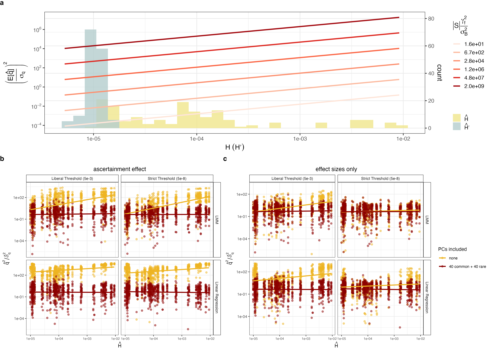
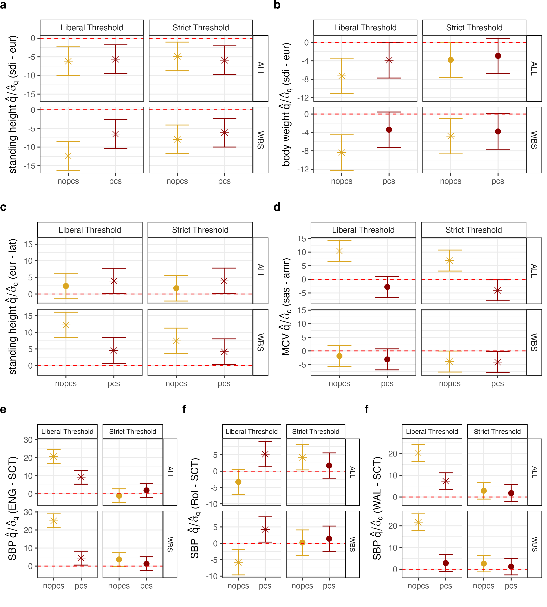

[← Back to Home]({{ '/' | relative_url }})

# PGS Association Tests

The final step brings everything together: we test whether a polygenic score is associated with a target ancestry axis. The test statistic, $\hat{q}$, is the covariance between the allele frequency contrast $\hat{r}$ (from [Genotype Contrasts](01-genotype-contrasts)) and the GWAS effect sizes $\hat{\beta}$ (from the [GWAS](05-gwas)), summed over the set $\mathcal{S}$ of variants included in the score:

$$\hat{q} = \sum_{\ell \in \mathcal{S}} \hat{r}_\ell \, \hat{\beta}_\ell.$$

Under the null hypothesis of no association between the polygenic score and the axis, $\mathbb{E}[\hat{q}] = 0$. A significantly non-zero $\hat{q}$ indicates that the score covaries with ancestry along the target axis — the signature of either real polygenic divergence or residual stratification bias. We report the standardized statistic $\hat{q}/\hat{\sigma}_q$, with the standard error from a block jackknife.

Each test is run across the full factorial of analysis choices from the previous pages — GWAS panel, correction (`pcs`/`nopcs`), model (`LR`/`LMM`), and ascertainment threshold (`strict`/`loose`) — so that the effect of each choice on the bias can be compared.

---

## Overview

The association test has four parts:

1. **Clump and threshold** the GWAS summary statistics to choose the SNP set $\mathcal{S}$ and its effect sizes.
2. **Assign the selected SNPs to LD blocks** for the jackknife.
3. **Compute $\hat{q}$ and test it** with a block jackknife.
4. **(Diagnostic) Decouple ascertainment from estimation** by re-scoring with uncorrected effect sizes, to isolate the role of ascertainment bias.

---

## Step 1: Clumping and thresholding

Polygenic scores are built by clumping and thresholding (C+T). This part of the pipeline lives in the **dataset-specific** snakefiles ([`snakefile_HGDP1KG`](https://github.com/jgblanc/strat2/blob/master/snakefile_HGDP1KG) and [`snakefile_InUKBB`](https://github.com/jgblanc/strat2/blob/master/snakefile_InUKBB)), since the prediction-panel SNP sets differ by dataset.

First, the raw regenie summary statistics are **thresholded** on the $-\log_{10}p$ column (`LOG10P`, field 13) with a quick awk filter — `loose` keeps $-\log_{10}p \ge 2.30103$ (i.e. $p \le 5\times10^{-3}$) and `strict` keeps $-\log_{10}p \ge 7.30103$ ($p \le 5\times10^{-8}$):

```
rule format_regenie_results_loose:
    input:
        ss="data/step2-results/{gwas}/{covars}/{gtype}/raw/chr{chr}_{phenotype}.regenie"
    output:
        temp("data/step2-results/{gwas}/{covars}/{gtype}/formatted/loose/chr{chr}_{phenotype}.regenie")
    shell:
        "awk 'NR==1 || $13 >= 2.30103' {input.ss} > {output}"

# format_regenie_results_strict is identical with the threshold 7.30103
```

Next, the thresholded statistics are **LD-clumped** with `plink2 --clump` (restricted to the SNPs overlapping the prediction panel) to retain approximately independent lead variants:

```
rule clump_regenie_results:
    input:
        ss="data/step2-results/{gwas}/{covars}/{gtype}/formatted/{threshold}/chr{chr}_{phenotype}.regenie",
        IDs = "data/ids/gwas_ids/{gwas}.txt",
        SNPs = "data/InUKBB/variants/{gwas}/overlappingSNPs_chr{chr}.txt"
    output:
        temp("data/step2-results/{gwas}/{covars}/{gtype}/clumped/{threshold}/{phenotype}_chr{chr}.clumps")
    shell:
        """
        plink2 --pfile {params.plink_prefix} \
        --keep {input.IDs} \
        --clump {input.ss} \
        --clump-p1 0.05 --clump-p2 0.05 \
        --clump-r2 0.1 --clump-kb 1000 \
        --clump-log10 --clump-p-field LOG10P \
        --extract {input.SNPs} \
        --out {params.out_prefix}
        """
```

[`format_clumps.R`](https://github.com/jgblanc/quantifying-susceptibility-PGS.github.io/blob/master/scripts/run_gwas/format_clumps.R) then joins the clumped lead SNPs back to the thresholded summary statistics to attach effect sizes (rule `combine_clumps_betas`):

```r
dfSNPs <- fread(ss_file)      # clumped lead SNPs
dfClump <- fread(clump_file)  # thresholded betas

if (nrow(dfSNPs) > 0) {
  dfOut <- inner_join(dfSNPs, dfClump) %>%
    select("#CHROM", "ID", "ALLELE0", "ALLELE1", "BETA")
  colnames(dfOut) <- c("#CHROM", "ID", "REF", "ALT", "BETA")
  fwrite(dfOut, out_file, sep = "\t")
}
```

Finally, the per-chromosome betas are concatenated (rule `combine_clumps`, a one-line awk) into the SNP set for the score at `data/{dataset}/prs/{gwas}/{covars}/{gtype}/{threshold}/{phenotype}.snps`. In `snakefile_HGDP1KG` this is computed per `{subdataset}` and then copied out to each contrast (`rename_clumps_*` rules); in `snakefile_InUKBB` it is copied to each country-of-birth contrast (`rename_clumped_snps`).

---

## Step 2: Assign selected SNPs to LD blocks

As with the susceptibility estimators, the jackknife operates over approximately independent LD blocks. [`add_block_info_gwas.R`](https://github.com/jgblanc/quantifying-susceptibility-PGS.github.io/blob/master/scripts/blocks/add_block_info_gwas.R) assigns each clumped SNP to a block:

```
rule block_snps_for_q:
    input:
        snps="data/{dataset}/prs/{gwas}/{covars}/{gtype}/{threshold}/{contrasts}/{phenotype}.snps",
        blocks="data/LD_blocks/big_blocks.bed"
    output:
        "data/{dataset}/prs/{gwas}/{covars}/{gtype}/{threshold}/{contrasts}/{phenotype}_block.snps"
    shell:
        """
        Rscript code/blocks/add_block_info_gwas.R {input.snps} {input.blocks} {output}
        """
```

---

## Step 3: Compute $\hat{q}$ and test significance

[`run_test_jacknife.R`](https://github.com/jgblanc/quantifying-susceptibility-PGS.github.io/blob/master/scripts/pga_test/run_test_jacknife.R) joins the block-labeled effect sizes to the per-chromosome contrast values, computes $\hat{q}$, and obtains a standard error by deleting one LD block at a time:

```
rule pga_test:
    input:
        betas="data/{dataset}/prs/{gwas}/{covars}/{gtype}/{threshold}/{contrasts}/{phenotype}_block.snps",
        r = expand("data/{dataset}/r/{gwas}/{contrasts}_chr{chr}.rvec", chr=CHR)
    output:
        results="output/pga_test/{dataset}/{gwas}/{covars}/{gtype}/{threshold}/{contrasts}/{phenotype}.results"
    shell:
        """
        Rscript code/pga_test/run_test_jacknife.R {input.betas} {output.results} {input.r}
        """
```

The statistic itself is the inner product of effect sizes and contrast values:

```r
calc_q <- function(df) {
  B <- df$BETA
  r <- df$r
  q <- t(B) %*% r
  return(q)
}
```

The standard error comes from a leave-one-block-out (LOCO) jackknife; the standardized statistic is $\hat{q}/\hat{\sigma}_q$, with a two-sided $p$-value:

```r
for (i in 1:num_blocks) {
  block_num <- unique(df$block)[i]
  df_LOCO <- df %>% filter(block != block_num)
  jacknives[i] <- calc_q(df_LOCO)
}
qBar   <- mean(jacknives)
sigma2 <- ((num_blocks - 1) / num_blocks) * sum((jacknives - qBar)^2)

q    <- calc_q(df)
pval <- pnorm(abs(q), mean = 0, sd = sqrt(sigma2), lower.tail = FALSE) * 2
q    <- calc_q(df) / sqrt(sigma2)   # standardized q-hat
```

Results are concatenated across all configurations into `plots/pga_test/{dataset}/{gwas}/q_results.txt` via `concat_q.R`.


Standardized PGS test statistics versus susceptibility

---

## Step 4: Decoupling ascertainment from estimation

To isolate the role of the ascertainment process (the amplification factor $\Phi$), we run a diagnostic in which SNPs are *ascertained* using the PC-corrected summary statistics but *scored* with the **uncorrected** effect sizes. [`down_sample_snps.R`](https://github.com/jgblanc/quantifying-susceptibility-PGS.github.io/blob/master/scripts/pga_test/down_sample_snps.R) takes the target (corrected) SNP set and swaps in the uncorrected betas from the raw regenie output:

```r
dfOut <- df %>%
  filter(`#CHROM` == 1) %>%
  left_join(dfR %>% select(ID, BETA_regenie = BETA), by = "ID") %>%
  mutate(BETA = coalesce(BETA_regenie, BETA)) %>%   # use uncorrected beta
  select(-BETA_regenie)
```

```
rule resample_snps_for_q:
    input:
        target_snps = "data/{dataset}/prs/{gwas}/pcs/{gtype}/{threshold}/{contrasts}/{phenotype}_block.snps",
        regenie_files = expand("data/step2-results/{gwas}/{covars}/{gtype}/raw/chr{chr}_{phenotype}.regenie", chr=CHR)
    output:
        "data/{dataset}/prs_resampled/{gwas}/{covars}/{gtype}/{threshold}/{contrasts}/{phenotype}_block.snps"
    shell:
        """
        Rscript code/pga_test/down_sample_snps.R {output} {input.target_snps} {input.regenie_files}
        """
```

The resampled SNP set is then run through the same `run_test_jacknife.R` (rule `pga_test_resample`) and concatenated into `plots/pga_test_resampled/{dataset}/{gwas}/q_results.txt`. Comparing the standard and resampled results shows how much of the bias is driven by ascertainment versus estimation.




Significant polygenic score-ancestry associations
